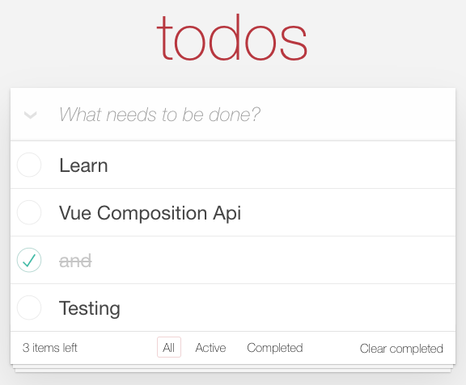

# Todo MVC built with Vue 3 Composition Api and Vuex

The well-known TodoMVC built with Vue 3 Composition Api and Vuex in a structured and testable way.

## Usage

After installing the dependencies the following NPM scripts become available:

- `start`: starts the application in development mode on [http://localhost:9000](http://localhost:9000)
- `build`: bundles the application for production into the `dist` folder
- `test`: runs unit and E2E tests
- `test:unit`: runs unit tests with [Mocha](https://mochajs.org/) and [Chai](https://www.chaijs.com/) in the `src` folder suffixed with `*.spec.js`
- `test:e2e`: runs E2E tests with [Cypress](https://www.cypress.io/) in the `tests/e2e` folder suffixed with `*.spec.js`
- `format`: formats the code with [Prettier](https://prettier.io/) within the `src` folder
- `lint`: lint files with [ESLint](https://eslint.org/) based on [Airbnb's styleguide](https://github.com/airbnb/javascript) and the Prettier config
